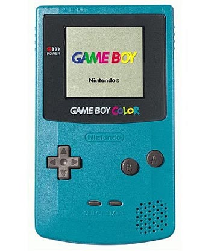

I first got my interest in software engineering when I got my first handheld device, the GameBoy Color. Now I know it sounds a little cliche, but it startled my mind how people were able to get a small device (at that time) to play these small (at that time) cartridges. That one curiousity had sparked the fire in me to want to know about how that worked. It would then evolve as time went on and technology advanced at an incredible rate. I got my first laptop in highschool and had that same curiosity that I had as a child. 

Things took a drastic turn in the right way when I made my way to college at the College of Engineering at the University of Hawaii at Manoa and I entered the Computer Engineering program, where I got my first few steps into the field that brought out the curiosuty from my childhood. I was able to learn coding as well as digital design techniques such as binary, hexadecimals, and HDLs (Hardware Description Languages). This is also the point where I got my interest in micro controllers as well as learning new coding languages.

As I come near the end of my college career, I am finding out new things about such as skills and experiences that I was to develop later in the future. I hope to learn about iOS develop just as a hobby though because I don't think I will get into that sort of position for now. I also hope to be able to apply myself so that I work more efficiently. 

