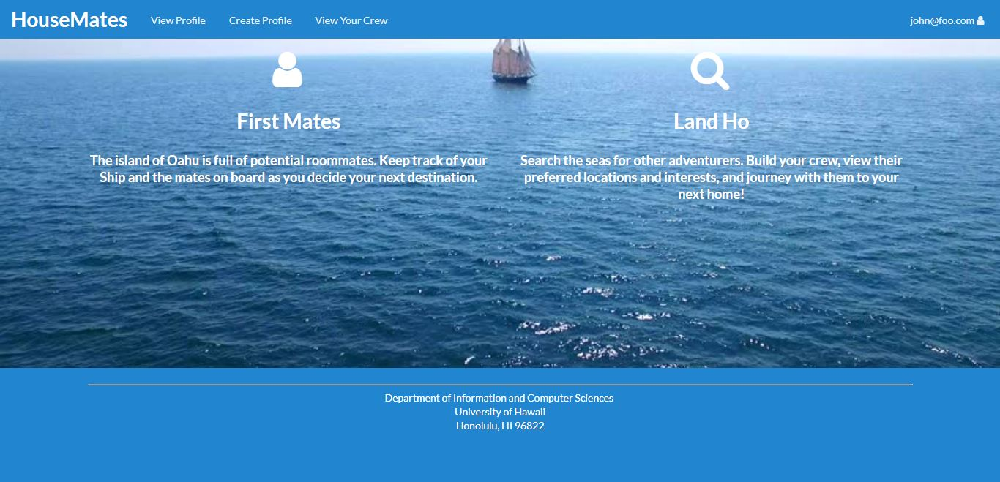
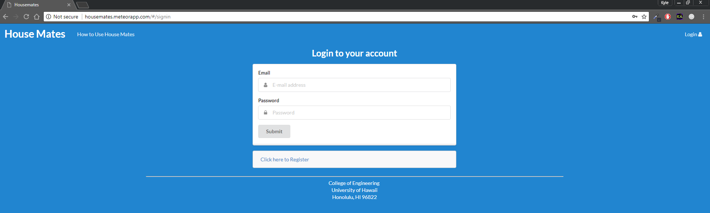
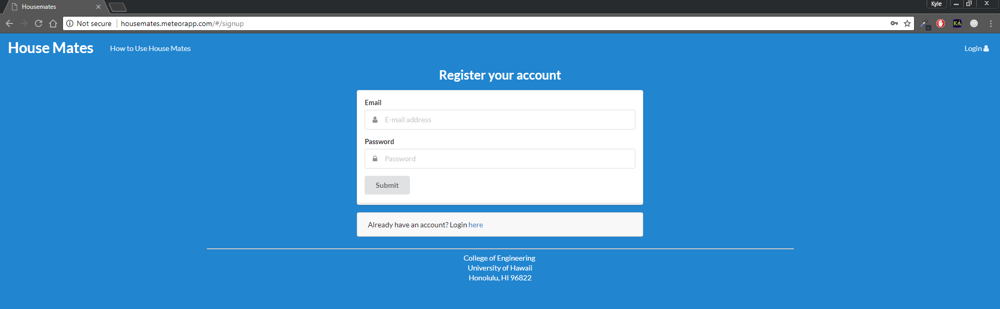
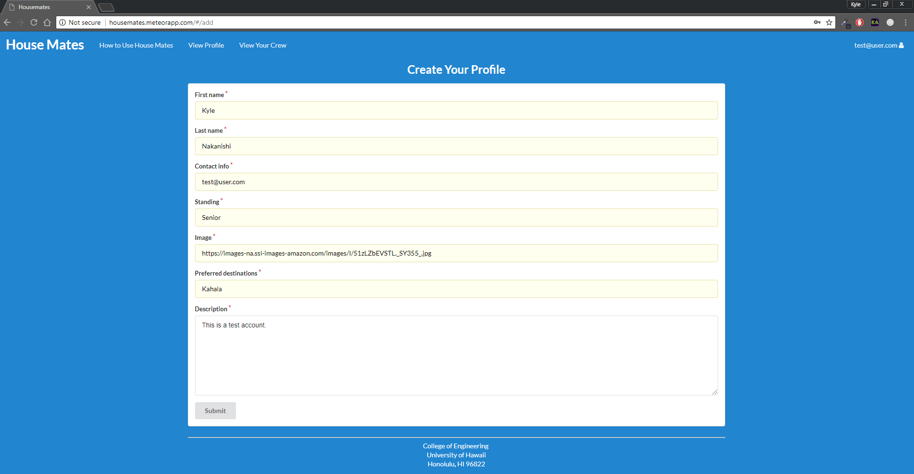
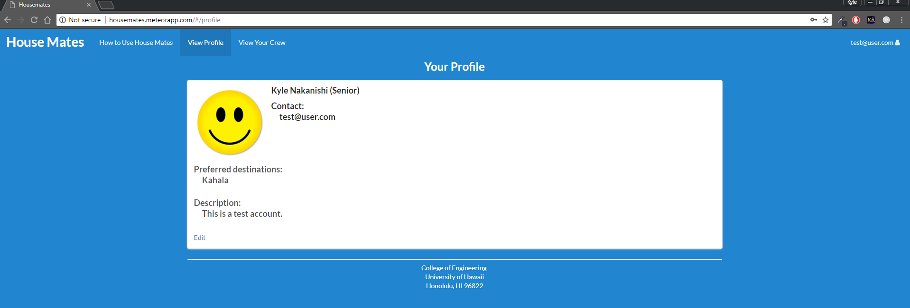
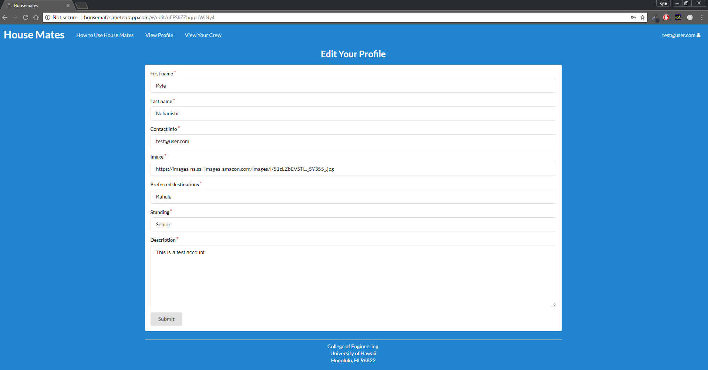
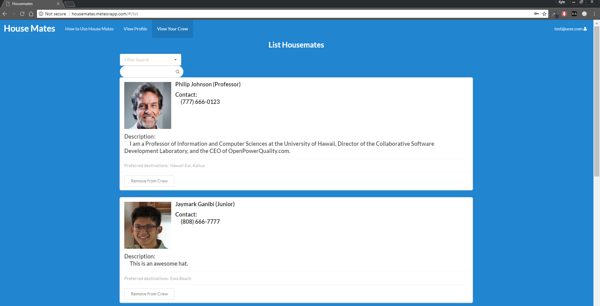
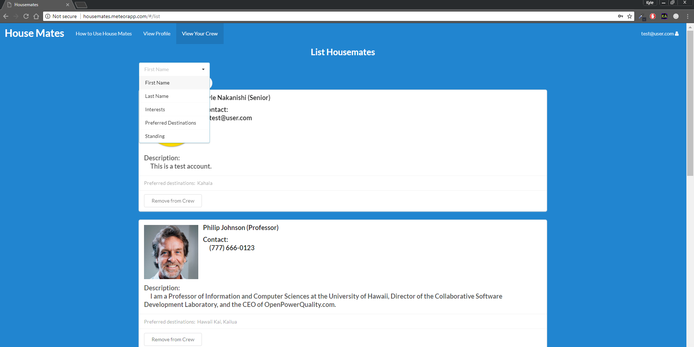

[Housemates](https://github.com/housemates/housemates) is a Meteor application that provides the University of Hawaii community with a means to collaborate on finding off-campus housing. Users will be able sign up for an account which will then allow them to find other users that want to live in the same area as they do. This assists students who want to find housing outside of campus. When looking for future housemates, the user can filter their search by name, certain area to live, and user description. If you see someone who looks like a reasonable roommate, they can contact them through any of their contact info. 

Here is a walkthrough of the application page by page.

## Landing Page

The landing page is what users are first greeted to when the enter the application. It inclused the navigation bar that inlcudes a tutorial on how to get started and the option to sign up or sign in.

## How to Use Housemates

This page is for people new to Housemates or want to learn more about Housemates. It guides new users on how to get started.

## Signing In/Signing Up

When users first enter the Landing Page, they get a brief overview of the features of House Mates. They can get a more detailed explanation and walkthrough with the option "How to Use House Mates", which is presented in the page's navigation bar before and after a user signs in. Users can create their own account with an email address and password, or they can sign in to an existing account. After signing up with an email and password, new users are directed to create their profile with the fields shown below:

## Createing Your Profile

New users are able to create their profile to fit their personality and information. Fields that are used to describe a profile are First Name, Last Name, Contact Info, Image, Class standing, place of interest to live, and a description of the user. 

## Viewing Profile

Users may view and edit their own profile in the "View Profile" option. This page displays the following components inputted by the user: their full name, class standing, contact information (email and/or phone number), places they would like to live, a description for them to include any other information about themselves, and an option to Edit these fields.

## Edit Your Profile

User can edit their profile by clicking on "Edit". The page is the exact same as the profile creation so they're a familiar what to fill in.

## Searching for Other Users

House Mates also allows registered users to search through other registered users for potential roommates. The search system can list users that satisfy criteria entered by the user, such as the first name, last name, class standing, or preferred destinations:

If a user no longer wishes to be connected to another user, they may also remove a user from their list of Housemates. This option is provided by a button in each profile on the ListHousemates page.

For more information, check out our [homepage](https://housemates.github.io/). Here, you can find more information on the app as well as learning how to install the app on your local host. All source code and information can be found [here](https://github.com/housemates/housemates).

## My Contribution
My role in our team was creating the user interface for the application. We decided as a group as to what features to have on the profile pages such as first and last name, contact info, desired destination, student grade level, and description. Since our application used a template, I also had to change up each profile was presented to the user. My other role was redirecting each page to make the user interface more simple. 
