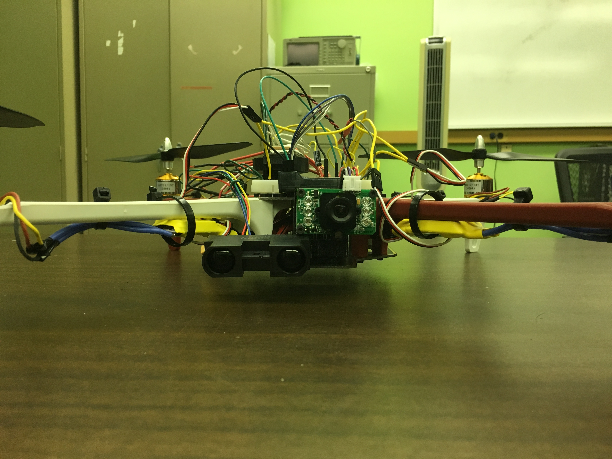
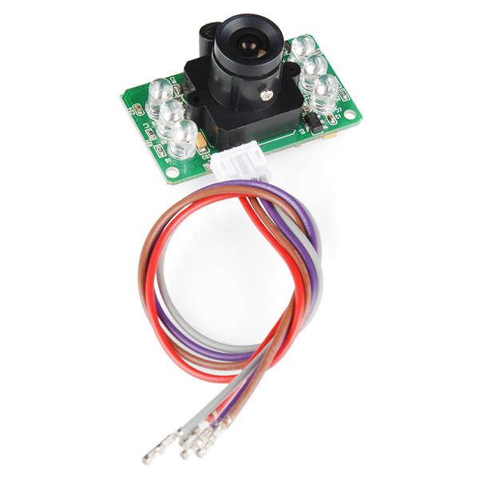
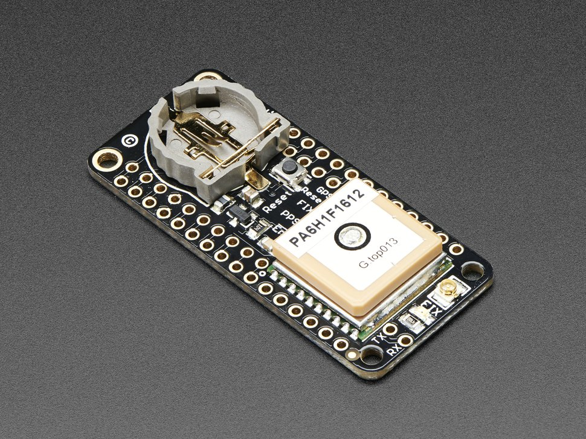
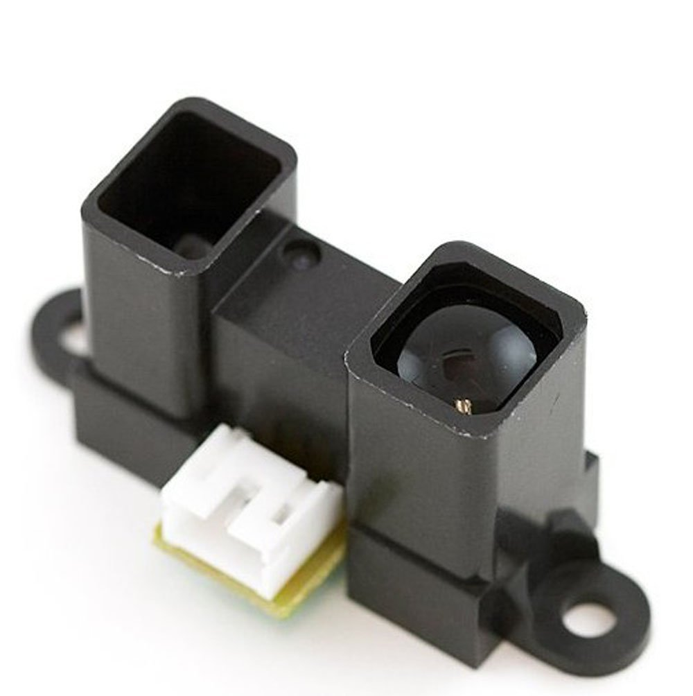

  
  
  
  

The Reconnaissance Drone project was started by my friend, Thomas Moriyasu. Thomas is an Army Scout, meaning his job is to locate the enemy and relay their positions back to his commander. There are times when they have to send out one to two men out to scout an area like the other side of a hill or river. This provides a risk of injury or death depending on the situation and a drone that is able to scout out the area for them would be able to reduce the chance of risk. . With the goal of reducing the amount of lives lost on missions and reducing the risks of going on a mission, we designed and built a drone to accomplish those tasks.

Our design is as follows. The system will be developed to improve the current army systems and give the soldier or operator the option to gather information from a safe location, exposing only a small drone which will limit a chance of getting detected. The drone will be near silent, meaning that someone would have to be within one to two meters in order to hear it. It will also be fast and maneuverable comparable to current racing drones that go 50-100 MPH. This will allow the user to gather information where fixed wing and larger drones cannot travel. The drone will also  be able to give military grid coordinates of a location/building/target to within 10 meters accuracy. The camera(s) mounted on the drone will give the user both day and night visuals and can be fed to the user’s headset which will be attached to their helmet. Users will be able to control the drone’s vertical thrust, horizontal movement, and orientation from a one-handed controller that’ll be able to attach to current issue rifle rail systems. The drone will be battery powered that’ll be replaceable within seconds to allow for minimal down time for the drone.

To implement our design, we used Arduino compatible components/parts. We may make our own drone frame from a 3D printer but for now we just used currently available products to deliver a working system that can be built cheaply for the army. All of the code used in this project was done on the Arduino IDE. Schematics and other circuits used were designed using the Logic Works 5 and Fritzing software. For hardware, we mostly used hand tools such as screwdrivers to make put together the drone frame as well as mount the modules. We used a soldering iron in order to implement our circuits and design. Lastly, we used the 3D printer in the FAB lab to make mounts for the modules (thanks to the help of one of the FAB lab operators). 

Modules that we used and implemented are a IR distance sensor to act as our LIDAR sensor, a infrared JPEG color camera to give us the day and night visuals for the user, and a GPS to give the coordinates and location of the drone to the user. We tested each part individually before mounting it to the drone and integrating them into one circuit to help give us a general reading for our tests. For the IR distance sensor, we tested its minimum and maximum distance reading to give us a range of where it is applicable in its current form. Obviously being an IR sensor, it works better in dim lighting because of light pollution that creates interference. For the JPEG camera, we just tested it so that it gave us an image that we could actually read. The GPS was tested to see how much distance error it gave, whether it gave a 5 meter off distance etc. The test results of the modules resulted in all modules working. The IR distance sensor and JPEG camera were mounted at the front of the drone and the GPS is to be mounted in the middle of the drone to give a more accurate reading. We have actually moved the GPS to be completed next semester due to the GPS giving us many problems during integration. 

My main assigned duty in the group is integration. The integration between software and hardware is a very important and difficult task. I was to take the code from the software team and make sure that it ran smoothly with the hardware components. Due to having to wait till all hardware and software components were tested and ran, I had to wait till mid November to start my work, but this didn’t pose as a problem for me. In the meantime while I waited for all of software and hardware to being close to done, I did smaller tasks and helped with the hardware team. At the start of the semester, I was in charge of ordering parts and making sure things got to us. I also slightly helped hardware do their weight testing early on in the semester and I also helped with designing and creating some schematics. 

When it got to mid November, that is when my integration began. At first, things were going smoothly. I was able to create a schematic of all the modules connected to one Arduino UNO and create a code that specifically called each module depending on the user input. For example, if the user typed ‘i’ or ‘I’ into the serial monitor, it would activate the IR distance sensor. However, things went south really fast once I got to the GPS. I couldn’t integrate the GPS into the code due to the fact that there was no code for it at all. It ran just by itself without code once it was connected to the Arduino. After almost 25 hours of researching and trying to integrate the GPS over a span of a week, I came to the conclusion that the GPS would have to be put off till next semester due to the time I had left. It came to me that the GPS module that we got didn’t give any data if there was any code that didn’t deal with the GPS. It had to be compiled with either a blank sketch or a sketch with code ONLY for the GPS specifically from the Adafruit GPS library. Any sight of code not for the GPS will prevent the GPS from giving us data. We are still able to run the GPS on a separate Arduino and serial monitor but that didn’t meet the conditions that Thomas had set for the integration.

What I learned from this semester on working on this project is that I need to communicate with the hardware team more and being more vocal on what I need from them in order for me to do my work efficiently. I also learned that working with GPS is a huge pain in the butt. In total, the experience was great and was a fun semester of working on this with my friends. If there was one thing that stuck with me, it is that integration can get frustrating and difficult really fast. 

