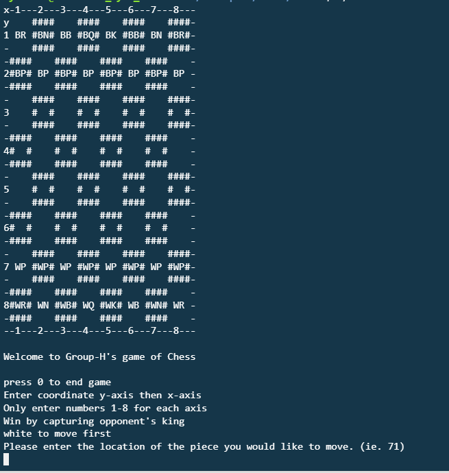

Chess is a two player (can be one player versus and AI) that uses a 64 x 64 board. Each player has 16 pieces: 8 Pawns, 2 Rooks, 2, Knights, 2 Bishops, 1 Queen, and 1 King. The game is over once a player has captured the opponent's King, one of the players surrenders, or ends in a stalemate. 

We designed our chess game to be a PVP (player vesus player) system where each player takes turns making their move. Due to time constraints that we had, our game does not include special moves such as castling and en passant. 

My role in the team was debugging the code for errors that we came upon on. I also helped one of my other teammates in creating a checkmate function. If I had completed most of my tasks, I joined in on the normal coding side to help with the piece movements.

As a team, we learned that chess algorightms can be really complicated to the point where we lose track of which piece we are working on. We also wished that we had completed the castling and en passant moves as well as having a GUI built in to make everything look better.
